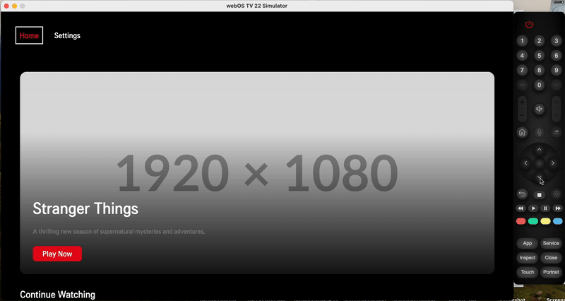

# CTV Streaming Application

A Connected TV (CTV) streaming application built with React, featuring a 10-foot UI experience optimized for TV viewing and navigation.

# Demo


## Features

- Home page with Hero Banner and content rails
- Settings page with subscription, profile, and device management
- TV-optimized navigation using D-pad controls
- Theme support (Light/Dark mode)
- Redux state management
- Focus management system for TV navigation
- Responsive 10-ft UI design

## Technology Stack

- React 18
- Redux Toolkit
- React Router v6
- Styled Components
- Testing Library

## Prerequisites

### Development Environment Setup
- Node.js and npm (latest LTS version recommended)
- WebOS CLI (Install from http://webostv.developer.lge.com/)
- Tizen Studio and Tizen CLI (Install from https://developer.tizen.org/development/tizen-studio/download)

## Platform-Specific Requirements

### WebOS
1. WebOS SDK and CLI tools
2. Valid WebOS TV Developer Account
3. Developer Mode enabled on your WebOS TV

### Tizen
1. Tizen Studio or CLI with TV extensions like certificate
2. Valid Samsung Developer Account
3. Developer Mode enabled on your Tizen TV

## Getting Started

1. Install dependencies:
```bash
npm install
```

2. Start the development server:
```bash
npm start
```

3. Build for production:
```bash
npm run build
```

## Design Decisions

- Used component-based architecture for better code organization and reusability
- Implemented custom focus management system for TV navigation
- Utilized Redux for state management and data persistence
- Styled-components for theming and component styling
- React Router for navigation between pages

## Known Limitations

- Mock data is used instead of real API integration
- Limited device testing capabilities
- Basic animation implementations

## TODO

- Implement real API integration
- Add more unit tests
- Enhance animation effects
- Add error boundaries
- Implement proper loading states
- Add more accessibility features

## Building and Deployment

### Building for WebOS
1. Install dependencies:
   ```bash
   npm install
   ```
2. Create WebOS package:
   ```bash
   npm run build:webos
   ```
3. Deploy to WebOS TV:
   ```bash
   npm run deploy:webos
   ```

### Building for Tizen
1. Install dependencies:
   ```bash
   npm install
   ```
2. Create Tizen package:
   ```bash
   npm run build:tizen
   ```
3. Deploy to Tizen TV:
   ```bash
   npm run deploy:tizen
   ```

## Project Structure

```
src/
  ├── components/       # Reusable UI components
  ├── pages/           # Page components
  ├── store/           # Redux store and slices
  ├── styles/          # Global styles and theme
  ├── utils/           # Utility functions
  ├── hooks/           # Custom React hooks
  ├── services/        # API and other services
  └── constants/       # Constants and configuration
```